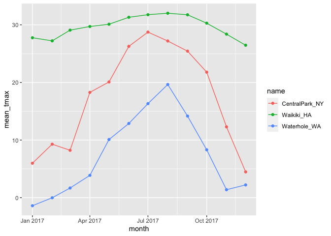

EDA
================

``` r
library(tidyverse)
```

    ## ── Attaching packages ─────────────────────────── tidyverse 1.3.0 ──

    ## ✓ ggplot2 3.3.2     ✓ purrr   0.3.4
    ## ✓ tibble  3.0.3     ✓ dplyr   1.0.2
    ## ✓ tidyr   1.1.2     ✓ stringr 1.4.0
    ## ✓ readr   1.3.1     ✓ forcats 0.5.0

    ## ── Conflicts ────────────────────────────── tidyverse_conflicts() ──
    ## x dplyr::filter() masks stats::filter()
    ## x dplyr::lag()    masks stats::lag()

``` r
library(ggridges)
```

## Load the weather data

``` r
weather_df =  
  rnoaa::meteo_pull_monitors(
    c("USW00094728", "USC00519397", "USS0023B17S"),
    var = c("PRCP", "TMIN", "TMAX"), 
    date_min = "2017-01-01",
    date_max = "2017-12-31") %>%
  mutate(
    name = recode(
      id, 
      USW00094728 = "CentralPark_NY", 
      USC00519397 = "Waikiki_HA",
      USS0023B17S = "Waterhole_WA"),
    tmin = tmin / 10,
    tmax = tmax / 10,
    month = lubridate::floor_date(date, unit = "month")) %>%
  select(name, id, everything())
```

    ## Registered S3 method overwritten by 'hoardr':
    ##   method           from
    ##   print.cache_info httr

    ## using cached file: /Users/test/Library/Caches/R/noaa_ghcnd/USW00094728.dly

    ## date created (size, mb): 2020-10-05 23:46:15 (7.522)

    ## file min/max dates: 1869-01-01 / 2020-10-31

    ## using cached file: /Users/test/Library/Caches/R/noaa_ghcnd/USC00519397.dly

    ## date created (size, mb): 2020-10-05 23:46:30 (1.699)

    ## file min/max dates: 1965-01-01 / 2020-03-31

    ## using cached file: /Users/test/Library/Caches/R/noaa_ghcnd/USS0023B17S.dly

    ## date created (size, mb): 2020-10-05 23:46:36 (0.88)

    ## file min/max dates: 1999-09-01 / 2020-10-31

``` r
head(weather_df)
```

    ## # A tibble: 6 x 7
    ##   name           id          date        prcp  tmax  tmin month     
    ##   <chr>          <chr>       <date>     <dbl> <dbl> <dbl> <date>    
    ## 1 CentralPark_NY USW00094728 2017-01-01     0   8.9   4.4 2017-01-01
    ## 2 CentralPark_NY USW00094728 2017-01-02    53   5     2.8 2017-01-01
    ## 3 CentralPark_NY USW00094728 2017-01-03   147   6.1   3.9 2017-01-01
    ## 4 CentralPark_NY USW00094728 2017-01-04     0  11.1   1.1 2017-01-01
    ## 5 CentralPark_NY USW00094728 2017-01-05     0   1.1  -2.7 2017-01-01
    ## 6 CentralPark_NY USW00094728 2017-01-06    13   0.6  -3.8 2017-01-01

## `group_by`

``` r
weather_df %>% 
  group_by(name, month) 
```

    ## # A tibble: 1,095 x 7
    ## # Groups:   name, month [36]
    ##    name           id          date        prcp  tmax  tmin month     
    ##    <chr>          <chr>       <date>     <dbl> <dbl> <dbl> <date>    
    ##  1 CentralPark_NY USW00094728 2017-01-01     0   8.9   4.4 2017-01-01
    ##  2 CentralPark_NY USW00094728 2017-01-02    53   5     2.8 2017-01-01
    ##  3 CentralPark_NY USW00094728 2017-01-03   147   6.1   3.9 2017-01-01
    ##  4 CentralPark_NY USW00094728 2017-01-04     0  11.1   1.1 2017-01-01
    ##  5 CentralPark_NY USW00094728 2017-01-05     0   1.1  -2.7 2017-01-01
    ##  6 CentralPark_NY USW00094728 2017-01-06    13   0.6  -3.8 2017-01-01
    ##  7 CentralPark_NY USW00094728 2017-01-07    81  -3.2  -6.6 2017-01-01
    ##  8 CentralPark_NY USW00094728 2017-01-08     0  -3.8  -8.8 2017-01-01
    ##  9 CentralPark_NY USW00094728 2017-01-09     0  -4.9  -9.9 2017-01-01
    ## 10 CentralPark_NY USW00094728 2017-01-10     0   7.8  -6   2017-01-01
    ## # … with 1,085 more rows

## Counting things

count months/names observations.

``` r
weather_df %>% 
  group_by(month) %>% 
  summarise(n_obs = n())
```

    ## `summarise()` ungrouping output (override with `.groups` argument)

    ## # A tibble: 12 x 2
    ##    month      n_obs
    ##    <date>     <int>
    ##  1 2017-01-01    93
    ##  2 2017-02-01    84
    ##  3 2017-03-01    93
    ##  4 2017-04-01    90
    ##  5 2017-05-01    93
    ##  6 2017-06-01    90
    ##  7 2017-07-01    93
    ##  8 2017-08-01    93
    ##  9 2017-09-01    90
    ## 10 2017-10-01    93
    ## 11 2017-11-01    90
    ## 12 2017-12-01    93

``` r
weather_df %>% 
  group_by(name) %>% 
  summarise(n_obs = n())
```

    ## `summarise()` ungrouping output (override with `.groups` argument)

    ## # A tibble: 3 x 2
    ##   name           n_obs
    ##   <chr>          <int>
    ## 1 CentralPark_NY   365
    ## 2 Waikiki_HA       365
    ## 3 Waterhole_WA     365

``` r
weather_df %>% 
  group_by(name, month) %>% 
  summarise(n_obs = n())
```

    ## `summarise()` regrouping output by 'name' (override with `.groups` argument)

    ## # A tibble: 36 x 3
    ## # Groups:   name [3]
    ##    name           month      n_obs
    ##    <chr>          <date>     <int>
    ##  1 CentralPark_NY 2017-01-01    31
    ##  2 CentralPark_NY 2017-02-01    28
    ##  3 CentralPark_NY 2017-03-01    31
    ##  4 CentralPark_NY 2017-04-01    30
    ##  5 CentralPark_NY 2017-05-01    31
    ##  6 CentralPark_NY 2017-06-01    30
    ##  7 CentralPark_NY 2017-07-01    31
    ##  8 CentralPark_NY 2017-08-01    31
    ##  9 CentralPark_NY 2017-09-01    30
    ## 10 CentralPark_NY 2017-10-01    31
    ## # … with 26 more rows

we can use `count()`

``` r
weather_df %>% 
  count(name, month, name = "n_obs")
```

    ## # A tibble: 36 x 3
    ##    name           month      n_obs
    ##    <chr>          <date>     <int>
    ##  1 CentralPark_NY 2017-01-01    31
    ##  2 CentralPark_NY 2017-02-01    28
    ##  3 CentralPark_NY 2017-03-01    31
    ##  4 CentralPark_NY 2017-04-01    30
    ##  5 CentralPark_NY 2017-05-01    31
    ##  6 CentralPark_NY 2017-06-01    30
    ##  7 CentralPark_NY 2017-07-01    31
    ##  8 CentralPark_NY 2017-08-01    31
    ##  9 CentralPark_NY 2017-09-01    30
    ## 10 CentralPark_NY 2017-10-01    31
    ## # … with 26 more rows

**NEVER** use base R’s ‘table’. 1. output is not a data frame. 2.take
one variable and make them into table is a bad idea.

``` r
weather_df %>% 
  pull(month) %>% 
  table()
```

other helpful counters.

``` r
weather_df %>% 
  group_by(month) %>% 
  summarise(
    n_obs = n(), 
    n_days = n_distinct(date))
```

    ## `summarise()` ungrouping output (override with `.groups` argument)

    ## # A tibble: 12 x 3
    ##    month      n_obs n_days
    ##    <date>     <int>  <int>
    ##  1 2017-01-01    93     31
    ##  2 2017-02-01    84     28
    ##  3 2017-03-01    93     31
    ##  4 2017-04-01    90     30
    ##  5 2017-05-01    93     31
    ##  6 2017-06-01    90     30
    ##  7 2017-07-01    93     31
    ##  8 2017-08-01    93     31
    ##  9 2017-09-01    90     30
    ## 10 2017-10-01    93     31
    ## 11 2017-11-01    90     30
    ## 12 2017-12-01    93     31

## A digression on 2x2 tables

``` r
weather_df %>% 
  filter(name != "Waikiki_HA") %>% 
  mutate(
    cold = case_when(
      tmax < 5 ~ "cold", 
      tmax >= 5 ~ "not cold", 
      TRUE      ~ ""
    )
  ) %>% 
  group_by(cold) %>% 
  summarise(count = n())
```

    ## `summarise()` ungrouping output (override with `.groups` argument)

    ## # A tibble: 2 x 2
    ##   cold     count
    ##   <chr>    <int>
    ## 1 cold       216
    ## 2 not cold   514

janitor tabyl

``` r
weather_df %>% 
  filter(name != "Waikiki_HA") %>% 
  mutate(
    cold = case_when(
      tmax < 5 ~ "cold", 
      tmax >= 5 ~ "not cold", 
      TRUE      ~ ""
    )
  ) %>% 
  janitor::tabyl(name, cold)
```

    ##            name cold not cold
    ##  CentralPark_NY   44      321
    ##    Waterhole_WA  172      193

## General Summaries

You can do lots of summaries.

``` r
weather_df %>% 
  group_by(name, month) %>% 
  summarise(
    mean_tmax = mean(tmax, na.rm = TRUE),
    mean_prcp = mean(prcp, na.rm = TRUE), 
    median_tmin = median(tmin, na.rm = TRUE)
  )
```

    ## `summarise()` regrouping output by 'name' (override with `.groups` argument)

    ## # A tibble: 36 x 5
    ## # Groups:   name [3]
    ##    name           month      mean_tmax mean_prcp median_tmin
    ##    <chr>          <date>         <dbl>     <dbl>       <dbl>
    ##  1 CentralPark_NY 2017-01-01      5.98      39.5         1.7
    ##  2 CentralPark_NY 2017-02-01      9.28      22.5         1.4
    ##  3 CentralPark_NY 2017-03-01      8.22      43.0         1.1
    ##  4 CentralPark_NY 2017-04-01     18.3       32.5         8.9
    ##  5 CentralPark_NY 2017-05-01     20.1       52.3        11.7
    ##  6 CentralPark_NY 2017-06-01     26.3       40.4        18.9
    ##  7 CentralPark_NY 2017-07-01     28.7       34.3        21.1
    ##  8 CentralPark_NY 2017-08-01     27.2       27.4        20  
    ##  9 CentralPark_NY 2017-09-01     25.4       17.0        18.4
    ## 10 CentralPark_NY 2017-10-01     21.8       34.3        13.9
    ## # … with 26 more rows

This is a data frame, so we can make a plot.

``` r
weather_df %>% 
  group_by(name, month) %>% 
  summarise(
    mean_tmax = mean(tmax, na.rm = TRUE),
    mean_prcp = mean(prcp, na.rm = TRUE), 
    median_tmin = median(tmin, na.rm = TRUE)
  ) %>% 
  ggplot(aes(x = month, y = mean_tmax, color = name)) +
  geom_point() +
  geom_line()
```

    ## `summarise()` regrouping output by 'name' (override with `.groups` argument)

<!-- --> **Suppose you
want to summarize many columns.**

``` r
weather_df %>% 
  group_by(name, month) %>% 
  summarise(across(prcp:tmin, mean))
```

    ## `summarise()` regrouping output by 'name' (override with `.groups` argument)

    ## # A tibble: 36 x 5
    ## # Groups:   name [3]
    ##    name           month       prcp  tmax   tmin
    ##    <chr>          <date>     <dbl> <dbl>  <dbl>
    ##  1 CentralPark_NY 2017-01-01  39.5  5.98  0.748
    ##  2 CentralPark_NY 2017-02-01  22.5  9.28  1.45 
    ##  3 CentralPark_NY 2017-03-01  43.0  8.22 -0.177
    ##  4 CentralPark_NY 2017-04-01  32.5 18.3   9.66 
    ##  5 CentralPark_NY 2017-05-01  52.3 20.1  12.2  
    ##  6 CentralPark_NY 2017-06-01  40.4 26.3  18.2  
    ##  7 CentralPark_NY 2017-07-01  34.3 28.7  21.0  
    ##  8 CentralPark_NY 2017-08-01  27.4 27.2  19.5  
    ##  9 CentralPark_NY 2017-09-01  17.0 25.4  17.4  
    ## 10 CentralPark_NY 2017-10-01  34.3 21.8  13.9  
    ## # … with 26 more rows

Reminder : sometimes your results are easier to read in another format.

``` r
weather_df %>% 
  group_by(name, month) %>% 
  summarise(mean_tmax = mean(tmax)) %>% 
  pivot_wider(
    names_from = name,
    values_from = mean_tmax
  ) %>% 
  knitr::kable(digits = 3)
```

    ## `summarise()` regrouping output by 'name' (override with `.groups` argument)

| month      | CentralPark\_NY | Waikiki\_HA | Waterhole\_WA |
| :--------- | --------------: | ----------: | ------------: |
| 2017-01-01 |           5.977 |      27.758 |       \-1.400 |
| 2017-02-01 |           9.282 |      27.218 |       \-0.018 |
| 2017-03-01 |           8.223 |      29.077 |         1.674 |
| 2017-04-01 |          18.273 |      29.713 |         3.873 |
| 2017-05-01 |          20.090 |          NA |        10.097 |
| 2017-06-01 |          26.263 |      31.310 |        12.873 |
| 2017-07-01 |          28.739 |          NA |        16.326 |
| 2017-08-01 |          27.194 |      32.016 |        19.645 |
| 2017-09-01 |          25.433 |      31.743 |        14.160 |
| 2017-10-01 |          21.787 |      30.287 |         8.313 |
| 2017-11-01 |          12.290 |      28.383 |         1.380 |
| 2017-12-01 |           4.474 |      26.461 |         2.213 |
